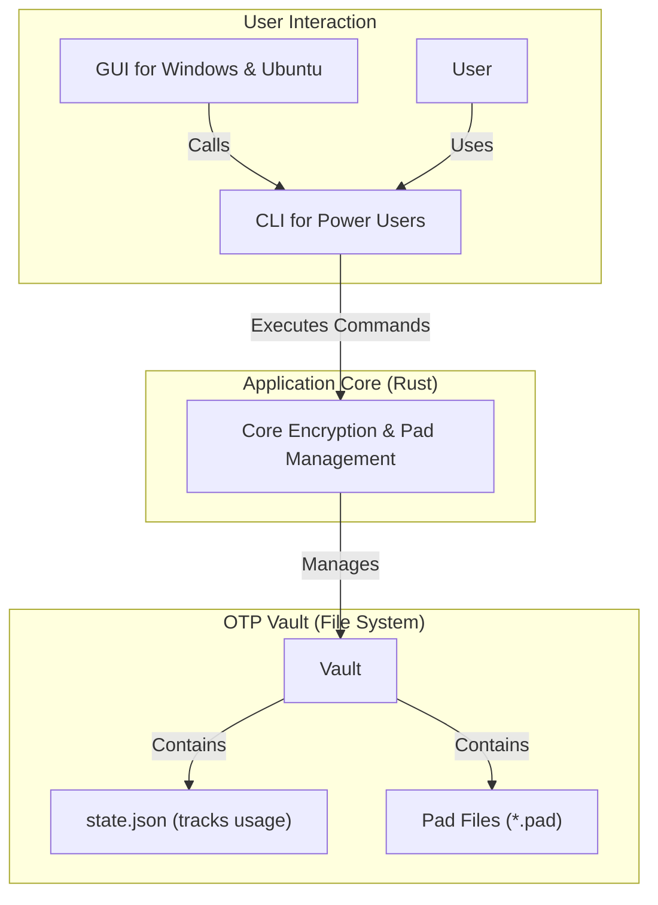
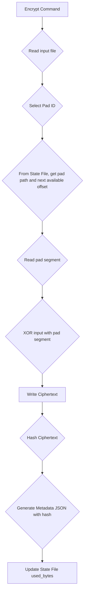
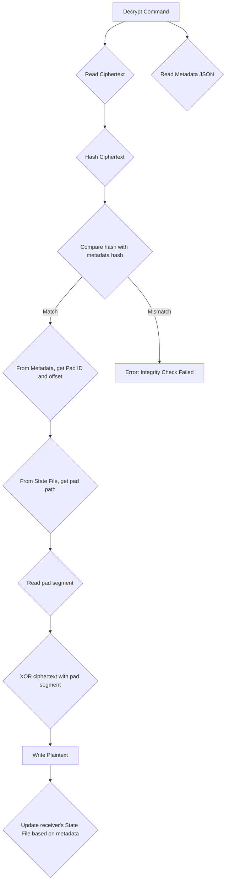

# OTP-Core Architecture

This document outlines the architecture for the `otp-cli` application, a commercial-grade tool for one-time pad (OTP) encryption.

## 1. High-Level Overview

The application is designed as a secure and robust system for managing and using one-time pads. It is built around a "core logic" Rust crate that handles all cryptographic operations and state management. Users can interact with this core logic through a Command-Line Interface (CLI) for power users and scripting, and a Graphical User Interface (GUI) for ease of use.

## 2. Component Diagram



## 3. Core Concepts

### 3.1. The OTP Vault

To ensure clear separation of concerns and portability, all pads and state are managed within a dedicated directory called a "Vault".

-   **Initialization**: A vault is created with `otp-cli vault init <path>`.
-   **Structure**:
    ```
    /my_secure_vault/
    ├── pads/
    │   ├── available/
    │   └── used/
    └── vault_state.json
    ```
-   **Usage**: All commands that operate on pads must specify the vault path via a `--vault` flag.

This design allows a user to maintain multiple, isolated sets of pads for different security contexts.

### 3.2. Pad Lifecycle and State Management

The system ensures that no byte of a pad is ever reused.

-   **State Tracking**: The `state.json` file tracks a list of used segments (`{start, end}`) for each pad. This allows for non-contiguous usage (via an optional `--offset` flag) while preventing segment reuse.
-   **Default Encryption**: By default, the system uses the next available contiguous block of the pad.
-   **Pad Depletion**: When a pad is fully consumed, it is automatically moved from the `pads/available/` directory to the `pads/used/` directory. It remains in the state file for decryption purposes but is no longer available for new encryptions.

### 3.3. Metadata

To enable decryption, a metadata file (`.json`) is generated alongside each ciphertext. This file contains the necessary information to locate the correct pad segment.

The enhanced metadata structure is as follows:

```json
{
  "pad_id": "string",
  "start_byte": "usize",
  "length": "usize",
}
```

The `ciphertext_hash` provides a mechanism to verify the integrity of the encrypted message, protecting against corruption and tampering.

## 4. CLI Command Structure

The CLI is designed to be intuitive and powerful, using nested subcommands for clarity.

-   `otp-cli --vault <PATH> vault <SUBCOMMAND>`
-   `otp-cli --vault <PATH> pad <SUBCOMMAND>`
-   `otp-cli --vault <PATH> encrypt ...`
-   `otp-cli --vault <PATH> decrypt ...`

**Vault Commands:**
-   `init <PATH>`: Initializes a new vault.
-   `status`: Shows vault summary.

**Pad Commands:**
-   `generate --size <MB>`: Creates a new pad.
-   `list`: Lists all pads and their status.
-   `delete --pad-id <ID>`: Deletes a pad.

**Encryption Command:**
-   `encrypt --input <FILE> --output <FILE> --pad-id <ID> [--offset <BYTES>]`
    -   The `--offset` is an optional flag for advanced users. The system includes strict checks to prevent reuse of pad segments.

## 5. Data Flow

### Encryption



### Decryption



## 6. Pad Synchronization

The security of any OTP system depends on the secure distribution and synchronization of pads between parties. This application is designed to facilitate this process, but it does not provide an online, secure channel for the synchronization itself.

### Initial Setup (Secure Channel Required)

1.  One party (the "initiator") creates an OTP Vault (`otp-cli vault init`).
2.  The initiator generates the required pads (`otp-cli pad generate`).
3.  The initiator **securely delivers a complete copy of the vault directory** to the other party. This must be done via a trusted, out-of-band method (e.g., physical delivery on an encrypted USB drive).

Both parties now have an identical set of pads and an identical initial state.

### Communication (Insecure Channel is OK)

1.  **Sender**: Encrypts a message. This creates a ciphertext and a metadata file, and updates the sender's state file.
2.  **Sender**: Sends the `ciphertext` and `metadata.json` to the receiver via any channel (e.g., email).
3.  **Receiver**: Runs the `decrypt` command. The application will:
    a. Verify the ciphertext integrity using the hash in the metadata.
    b. Decrypt the message using the correct pad segment.
    c. **Update the receiver's state file** to mark the pad segment as used, ensuring both parties remain synchronized.
    
## 7. Automated Releases

The project is configured with a GitHub Actions workflow that automatically builds and releases pre-compiled binaries for Windows and Linux. This ensures that users can easily download and use the `otp-cli` tool without needing to set up a Rust development environment. The binaries are published to the GitHub Releases page upon tagging a new version.