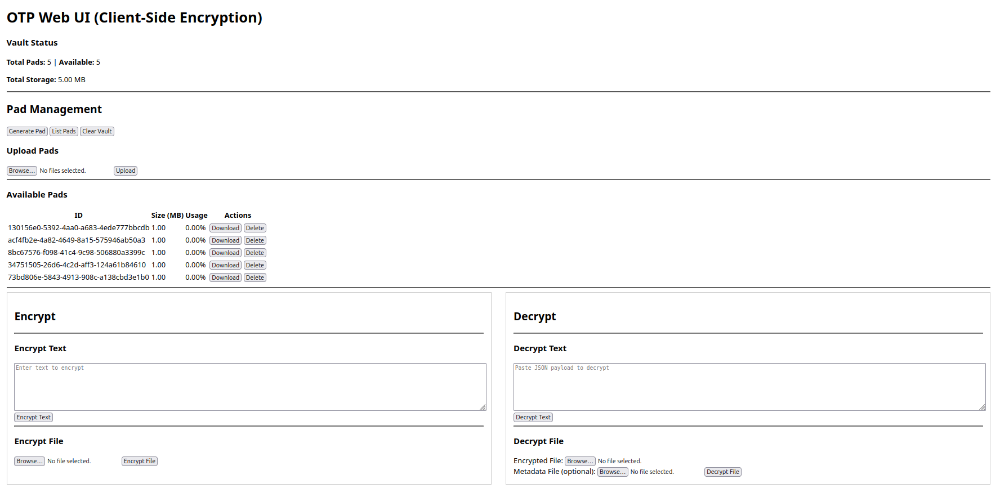

# OTP-Core



A command-line tool for secure one-time pad (OTP) encryption.

## Overview

OTP-CLI provides a simple and secure way to encrypt and decrypt files using the one-time pad method. It ensures that each segment of the pad is used only once, making it a robust tool for protecting sensitive information.

## Features

-   **Secure Pad Generation:** Generate cryptographically secure one-time pads of any size.
-   **State Management:** Automatically tracks pad usage to prevent reuse.
-   **Metadata-Driven Decryption:** Decryption is driven by a metadata file, ensuring that the correct pad and segment are always used.
-   **Streaming Encryption/Decryption:** Efficiently handles large files by processing them in streams.

## Installation

1.  Clone the repository:
    ```sh
    git clone https://github.com/apezoo/rust-otp.git
    cd otp-cli
    ```

2.  Build the project:
    ```sh
    cargo build --release
    ```

3.  The executable will be located at `target/release/otp-cli`.

## Usage

### 1. Generate a Pad

Create a new one-time pad with a unique ID.

```sh
otp-cli generate --pad-id my-secret-pad --path /path/to/pad.bin --size 10
```

-   `--pad-id`: A unique identifier for the pad.
-   `--path`: The location to save the pad file.
-   `--size`: The size of the pad in megabytes (MB).

### 2. Encrypt a File

Encrypt a file using a previously generated pad.

```sh
otp-cli encrypt --pad-id my-secret-pad --input /path/to/plaintext.txt --output /path/to/ciphertext.bin
```

-   `--pad-id`: The ID of the pad to use for encryption.
-   `--input`: The path to the file to encrypt.
-   `--output`: The path to save the encrypted file.

This will create two files: `ciphertext.bin` (the encrypted content) and `ciphertext.bin.metadata.json` (the decryption metadata).

### 3. Decrypt a File

Decrypt a file using the encrypted file and its metadata.

```sh
otp-cli decrypt --input /path/to/ciphertext.bin --metadata /path/to/ciphertext.bin.metadata.json --output /path/to/decrypted.txt
```

-   `--input`: The path to the encrypted file.
-   `--metadata`: The path to the decryption metadata file.
-   `--output`: The path to save the decrypted file.