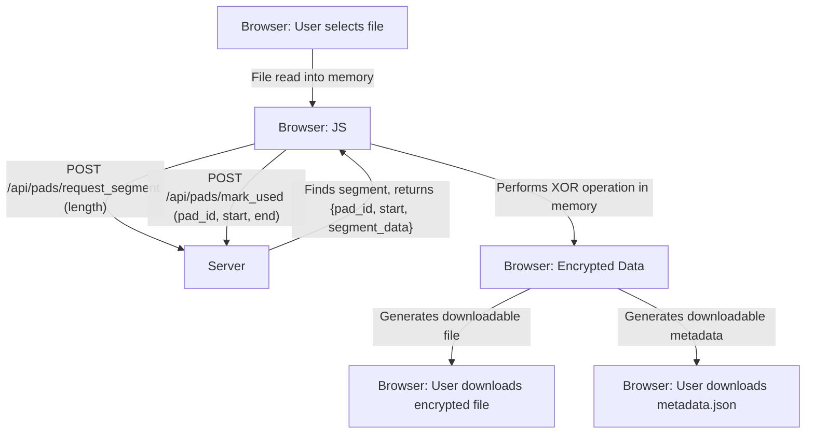
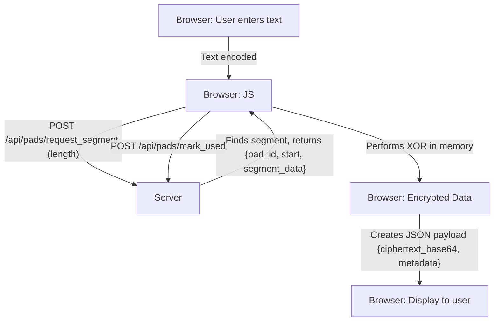

# OTP-Web Architecture (Client-Side Encryption Model)

This document outlines the revised architecture for the `otp-web` application. The new model prioritizes security by performing all cryptographic operations on the client-side (in the browser), ensuring that plaintext data is never transmitted to the server.

## 1. High-Level Overview

The application is a hybrid system. A Rust-based backend, built with Axum, is responsible for serving the frontend and managing the state of the one-time pad (OTP) vault. The frontend, a vanilla JavaScript single-page application, handles all user interactions, file processing, and cryptographic operations.

## 2. Component Diagram

```mermaid
graph TD
    subgraph "Browser (Client-Side)"
        Frontend[HTML/JS/CSS] -- "Manages" --> UserFiles[Plaintext Files (in memory)];
        Frontend -- "Requests Pad Segment" --> WebServer;
        Frontend -- "Performs XOR" --> Crypto[In-Browser Crypto];
        UserFiles -- "Processed by" --> Crypto;
        PadSegment[Pad Segment (in memory)] -- "Used by" --> Crypto;
        Crypto -- "Outputs" --> EncryptedData[Encrypted Data];
        Frontend -- "Updates Server" --> WebServer;
    end

    subgraph "Server (Backend)"
        WebServer[Axum Web Server] -- "Serves" --> Frontend;
        WebServer -- "Provides Pad Segment" --> PadSegment;
        WebServer -- "Uses" --> CoreLogic[otp-core Library];
    end

    subgraph "Core Logic"
        CoreLogic -- "Manages" --> Vault[OTP Vault];
    end
```

## 3. Core Technologies

-   **Backend**: Axum web framework.
-   **Frontend**: Vanilla HTML, CSS, and JavaScript. The frontend is responsible for:
    -   Reading local files into memory.
    -   Requesting pad data from the server.
    -   Performing the XOR operation for encryption/decryption.
    -   Generating downloadable file blobs.
-   **Core Logic**: `otp-core` library for state management.

## 4. API Endpoints

The API is now designed to support a client-side encryption workflow.

-   `GET /api/vault/status`: Returns vault statistics.
-   `POST /api/vault/clear`: Clears the vault.
-   `GET /api/pads`: Lists all pads in the vault.
-   `POST /api/pads/generate`: Generates new one-time pads.
-   `DELETE /api/pads/:pad_id`: Deletes a specified pad from the vault.
-   `GET /api/pads/:pad_id/download`: Downloads a specific pad file for sharing.
-   `POST /api/pads/upload`: Uploads one or more pad files to the vault.
-   `POST /api/pads/request_segment`: Requests a specific segment from a pad for a client-side cryptographic operation.
-   `POST /api/pads/mark_used`: Marks a pad segment as used after a client-side operation is complete.

## 5. Data Flow

### Client-Side Encryption (File)



### Client-Side Encryption (Text)



### Pad Exchange Flow

```mermaid
graph TD
    subgraph Alice
        A[Browser] -- "Generates/Selects Pad" --> B[Alice's Server];
        B -- "GET /api/pads/:id/download" --> A;
        A -- "Saves Pad File" --> A;
    end
    
    A -- "Sends Pad File (Offline)" --> C[Bob's Browser];

    subgraph Bob
        C -- "POST /api/pads/upload (file)" --> D[Bob's Server];
        D -- "Adds pad to vault" --> E[otp-core Library];
        D -- "Returns Success" --> C;
    end
