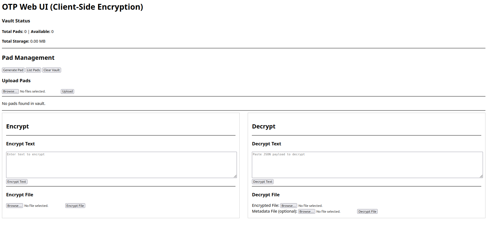

# OTP-Web



This crate provides a web-based user interface for the OTP encryption tool. It is built with Axum and performs all cryptographic operations on the client-side for maximum security. The application is designed as a single, self-contained binary with all static assets (HTML, JS, CSS) embedded, which simplifies deployment and distribution.

## Features

-   Generate, upload, download, and delete one-time pads.
-   Encrypt and decrypt text and files directly in the browser.
-   Client-side encryption ensures that plaintext data never leaves your machine.

## Getting Started

To run the web server:

```bash
cargo run -p otp-web